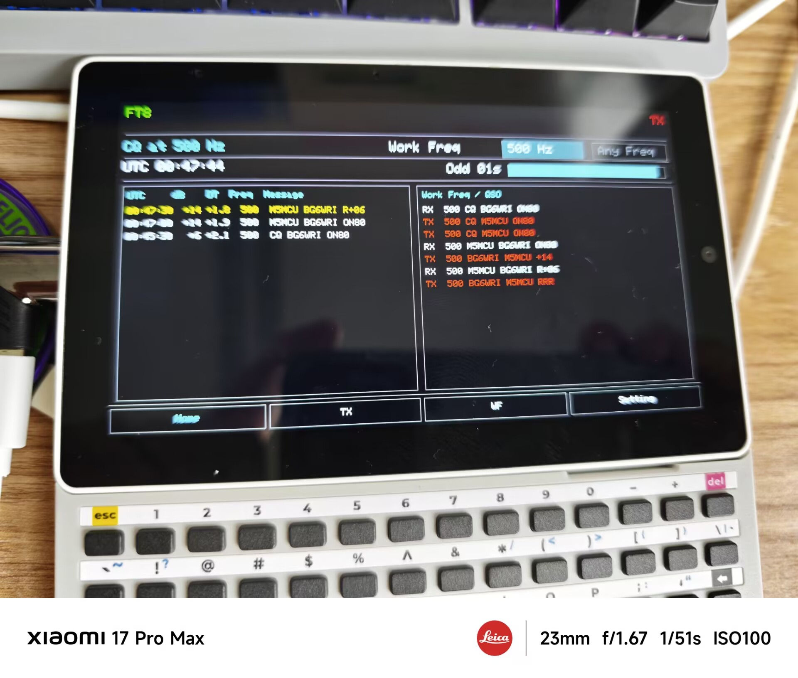

# M5WSJTx
A FT4/FT8 codec on M5Stack hardwares.

## Mode

- FT8  

## Acknowledgements

The FT8 core functionality of this project is made possible thanks to:  
[ft8_lib](https://github.com/kgoba/ft8_lib) - A robust FT8 library for microcontrollers developed by kgoba.