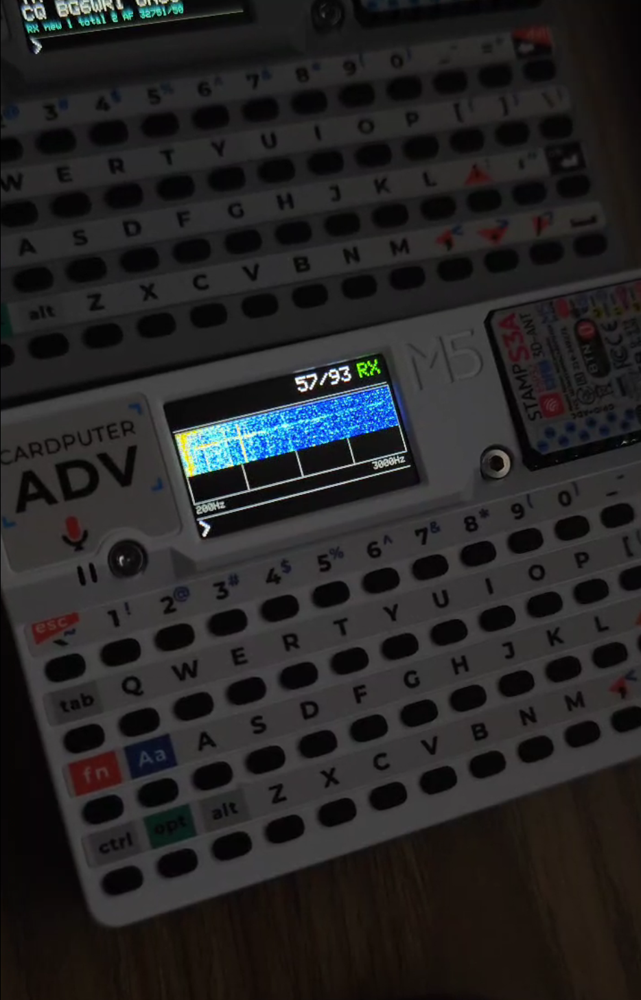

# CardFTx
A FT4/FT8 codec on Cardputer.

## Installation

- **Board:** M5Stack (3.2.6, mic is disable on 3.3.7)  
- **Libraries:** M5Cardputer (and all required dependencies)

## Setting

- **Partition Scheme:** 
- **Flash Size:** 8MB(64Mb)  
- **PSRAM:** QSPI PSRAM  

## Mode

- FT8, FT4

## Usage

- **ESC**: Abort the current task  
- **Fn + M**: Switch modulation/demodulation mode  

## Acknowledgements

The FT8 core functionality of this project is made possible thanks to:  
[ft8_lib](https://github.com/kgoba/ft8_lib) - A robust FT8 library for microcontrollers developed by kgoba.